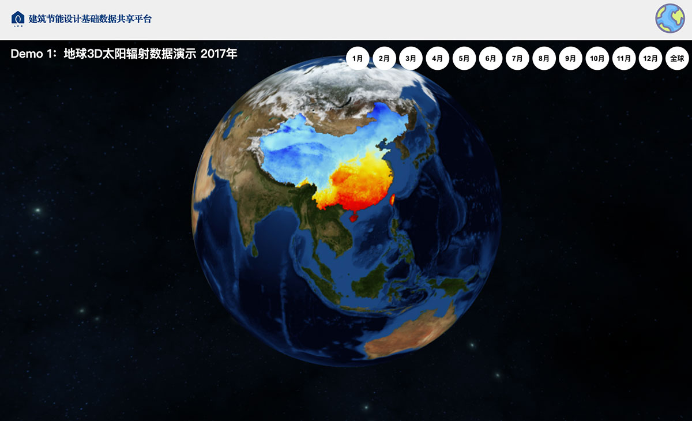
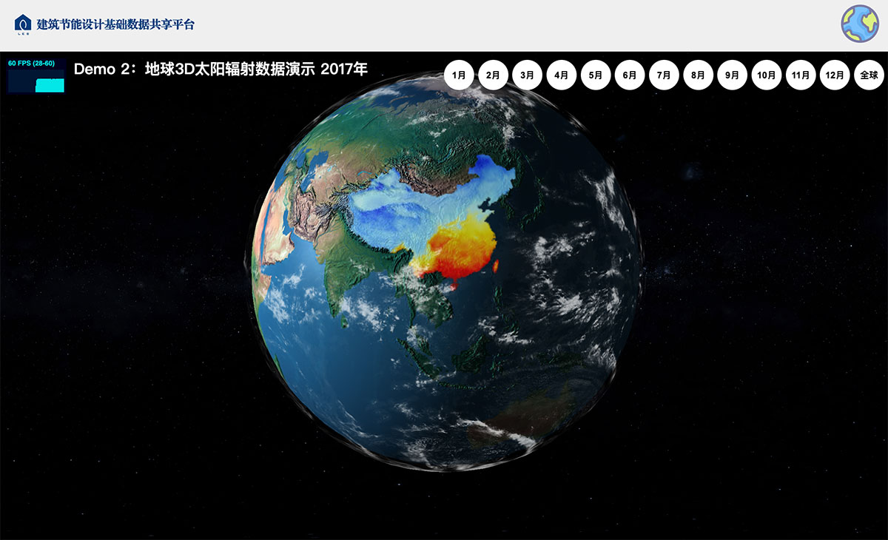

<p align="center">
 
 <h2 align="center">Earth3D Three.js</h2>
 <p align="center">使用 Three.js 绘制 3D 地球来演示气候数据与太阳辐射数据</p>
</p>
<p align="center">
  <a href="https://threejs.org/">
      
  </a>
  <a href="https://github.com/pudding0503/earth3d-radiation-threejs/issues">
  	
  </a>
  <a href="https://github.com/pudding0503/earth3d-radiation-threejs/blob/main/LICENSE">
  	
  </a>
</p>


### 1.简介

本例采用了 Three.js 库，这是一个非常出色的 WebGL 渲染的 JavaScript 库。使用 Three.js 绘制 3D 地球进行 netCDF 数据展示，原理与 Google Earth 极为相似，所需的信息也跟 KML 文件没有太大差别。

### 2.例示数据

本例中采用的 netCDF 例示数据与 [nc2kml](https://github.com/pudding0503/nc2kml) 相同。

本例采用的 nc 数据为（仅选取2018年逐月的数据演示）：

```
# 1979年1月至2018年12月的中国逐月太阳辐射数据集
lrad_CMFD_V0106_B-01_01mo_010deg_197901-201812.nc
```

本例采用的 nc4 数据为（仅选取1980年1月1日21时的数据演示）：

```
# 1980年1月1日的全球太阳辐射数据集
MERRA2_100.tavg1_2d_rad_Nx.19800101.nc4
```

这两个文件均可在 [Release](https://github.com/pudding0503/nc2kml/releases) 页面下载。如何将 netCDF 数据导出成我们需要的图片，可以参考 [nc2kml](https://github.com/pudding0503/nc2kml)，里面有非常详细的说明。

### 3.两个例子 🌰

总共准备了两个例子和相同的例示数据，可以对比进行查看：

| [演示一](https://pudding.nousbuild.com/earth3d-radiation-threejs/earth3d-demo1/) | [演示二](https://pudding.nousbuild.com/earth3d-radiation-threejs/earth3d-demo2/) |
| :----------------------------------------------------------: | :----------------------------------------------------------: |
| <a href="https://pudding.nousbuild.com/earth3d-radiation-threejs/earth3d-demo1/"></a> | <a href="https://pudding.nousbuild.com/earth3d-radiation-threejs/earth3d-demo2/"></a> |